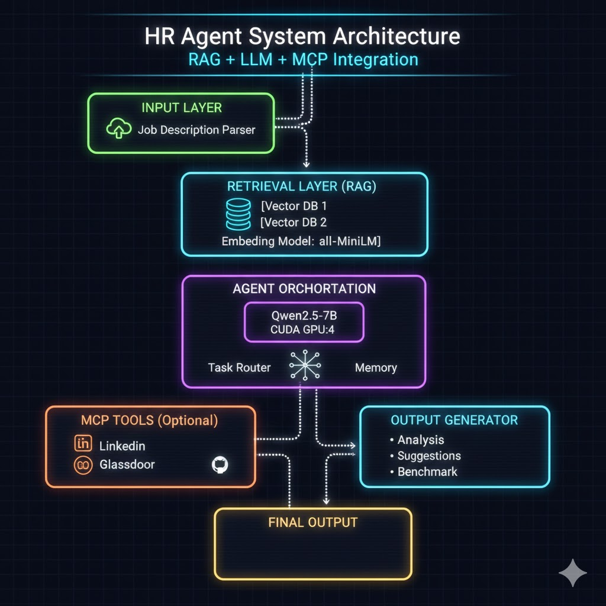
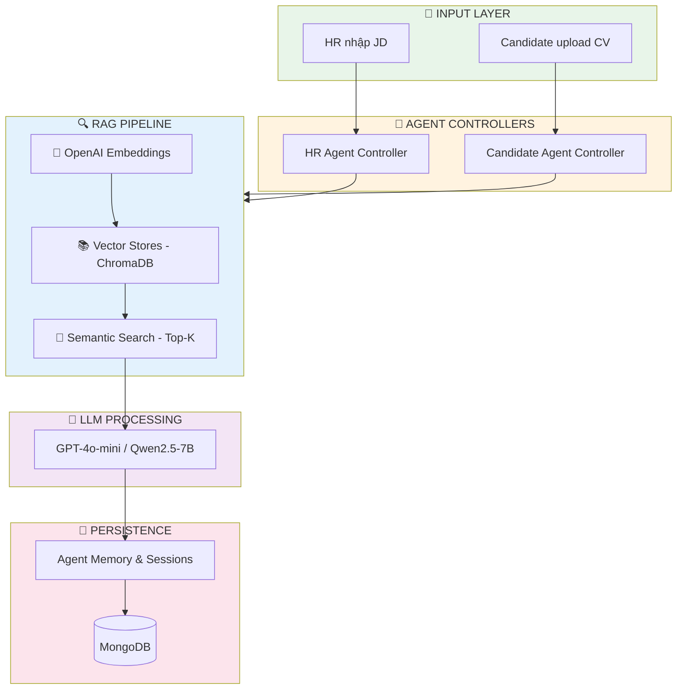
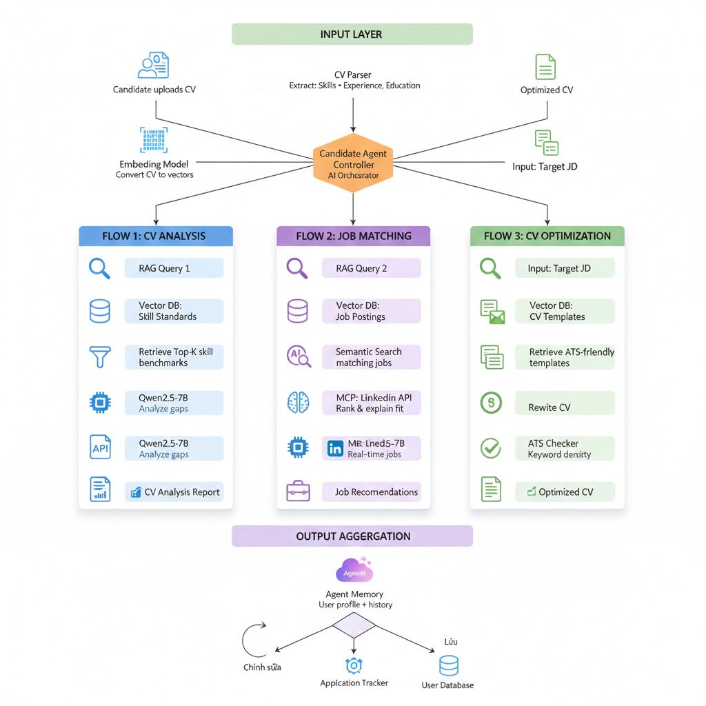

# 🚀 RAG + Agent System - Nền tảng Tuyển dụng Thông minh

> Hệ thống AI Agent sử dụng RAG (Retrieval-Augmented Generation) kết hợp LLM để hỗ trợ toàn diện quy trình tuyển dụng cho cả **Nhà tuyển dụng (HR)** và **Ứng viên (Candidate)**.



---

## 📋 Mục lục

- [Tính năng chính](#-tính-năng-chính)
- [Kiến trúc hệ thống](#️-kiến-trúc-hệ-thống)
- [Cài đặt](#-cài-đặt)
- [API Endpoints](#-api-endpoints)
- [Hướng dẫn sử dụng](#-hướng-dẫn-sử-dụng)
- [Cấu trúc dự án](#-cấu-trúc-dự-án)
- [Testing](#-testing)

---

## ✨ Tính năng chính

### 🎯 HR Agent - Hỗ trợ Nhà tuyển dụng

<table>
<tr>
<td width="50%">

#### 📊 Phân tích Job Description
- ✅ Đánh giá độ dài & readability score
- ✅ Trích xuất skills & phát hiện skill gaps
- ✅ Nhận diện seniority level tự động
- ✅ Tính điểm competitiveness (0-100)
- ✅ So sánh với market trends

</td>
<td width="50%">

#### 💡 Tối ưu Job Description
- ✅ Gợi ý điều chỉnh seniority level
- ✅ Phân loại Must-have vs Nice-to-have
- ✅ Phát hiện missing critical elements
- ✅ Cải thiện tone & language
- ✅ Recommendations về structure

</td>
</tr>
<tr>
<td width="50%">

#### 💰 Benchmark Lương
- ✅ Market range (min-max-median)
- ✅ Competitor average
- ✅ Location-adjusted compensation
- ✅ Confidence level & data quality
- ✅ Market insights

</td>
<td width="50%">

#### 💬 Chat với AI Agent
- ✅ Multi-turn conversation
- ✅ Context-aware responses
- ✅ Auto retrieve relevant knowledge
- ✅ Session management

</td>
</tr>
</table>

---

### 🎓 Candidate Agent - Hỗ trợ Ứng viên

<table>
<tr>
<td width="50%">

#### 📄 Upload & Parse CV
- 📤 Hỗ trợ PDF & DOCX format
- 🔍 Auto extract:
  - Personal info
  - Technical & soft skills
  - Work experience & achievements
  - Education & certifications
- 📊 Tính years of experience
- 🎯 Phát hiện career level

</td>
<td width="50%">

#### 🔬 CV Analysis
- 💪 Strengths Assessment (Top 3-5)
- ⚠️ Gap Analysis vs market
- 📈 Career Level Evaluation
- 🎯 Skill Priority Matrix
- 🚩 Red Flags Detection
- 💵 Salary Range Estimation

</td>
</tr>
<tr>
<td width="50%">

#### 🎯 Job Matching
- 🔍 Semantic Search based CV
- 📊 Fit Score Calculation:
  - Skills match rate
  - Experience level alignment
  - Years of experience fit
- 🏆 Top 10-20 ranked jobs
- 💬 AI Explanation cho mỗi match

</td>
<td width="50%">

#### ✨ CV Optimization (ATS-Ready)
- 🔑 Keyword extraction từ JD
- 📝 ATS-friendly rewriting
- ✅ ATS Compatibility Check:
  - Keyword match (40%)
  - Format compliance (25%)
  - Readability (15%)
  - Structure validation (20%)
- 💡 Actionable suggestions

</td>
</tr>
</table>

---

## 🏗️ Kiến trúc Hệ thống



### 📊 Vector Store Collections

| Collection | Purpose | Documents |
|------------|---------|-----------|
| **HR Collections** |
| `hr_market_trends` | Job market trends, skill demands | ~500 docs |
| `hr_jd_templates` | JD templates, best practices | ~200 docs |
| `hr_salary_data` | Salary benchmarks, compensation | ~1000 docs |
| **Candidate Collections** |
| `candidate_skill_standards` | Skill requirements by level | ~300 docs |
| `candidate_job_postings` | Available job postings | ~2000 docs |
| `candidate_cv_templates` | ATS-friendly CV templates | ~100 docs |

---

## 📦 Cài đặt

### Prerequisites

```bash
# Required
✅ Node.js >= 18
✅ MongoDB >= 5.0
✅ OpenAI API key

# Optional
🔹 ChromaDB (hoặc sử dụng in-memory)
🔹 Ollama (nếu muốn dùng local LLM)
```

### Installation Steps

#### 1️⃣ Clone & Install Dependencies

```bash
git clone <repository-url>
cd job_connection_be
npm install
```

#### 2️⃣ Environment Setup

```bash
cp .env.example .env
```

**Cấu hình `.env`:**

```env
# ============================================
# DATABASE
# ============================================
MONGO_URI=mongodb://localhost:27017/job_connection

# ============================================
# AI/ML SERVICES
# ============================================
# OpenAI
OPENAI_API_KEY=sk-your-api-key-here
LLM_MODEL=gpt-4o-mini

# ChromaDB (Optional - defaults to in-memory)
CHROMA_URL=http://localhost:8000

# ============================================
# SERVER CONFIG
# ============================================
PORT=8080
NODE_ENV=development
```

#### 3️⃣ Start ChromaDB (Optional)

**Option A: Python**
```bash
pip install chromadb
chroma run --path ./chroma_data
```

**Option B: Docker**
```bash
docker run -p 8000:8000 chromadb/chroma
```

#### 4️⃣ Seed Vector Stores

```bash
# Seed HR Agent data
node scripts/seed-vector-stores.js

# Seed Candidate Agent data (coming soon)
node scripts/seed-candidate-vectors.js
```

#### 5️⃣ Start Server

```bash
# Development mode (with hot reload)
npm run dev

# Production mode
npm start
```

✅ Server running at: `http://localhost:8080`

---

## 🌐 API Endpoints

### 🎯 HR Agent APIs



#### **1. Analyze Job Description**

```http
POST /api/rags/hr-agent/analyze-jd
Content-Type: application/json
```

**Request Body:**
```json
{
  "jdText": "We are looking for a Senior Software Engineer with 5+ years...",
  "metadata": {
    "position": "Senior Software Engineer",
    "company": "ABC Corp",
    "location": "Ho Chi Minh City"
  }
}
```

**Response:**
```json
{
  "success": true,
  "data": {
    "basic_stats": {
      "word_count": 450,
      "readability_score": 65.2,
      "reading_time_minutes": 2
    },
    "extracted_features": {
      "skills": ["React", "Node.js", "AWS", "Docker"],
      "seniority_level": {
        "level": "senior",
        "confidence": 85
      }
    },
    "llm_analysis": {
      "length_analysis": {
        "assessment": "optimal",
        "recommendation": "Length is appropriate for senior role"
      },
      "skill_gaps": [
        "Missing soft skills requirements",
        "No mention of team collaboration"
      ],
      "competitiveness_score": {
        "score": 78,
        "factors": {
          "salary": 85,
          "benefits": 70,
          "growth": 80
        }
      }
    }
  }
}
```

---

#### **2. Optimize Job Description**

```http
POST /api/rags/hr-agent/optimize-jd
Content-Type: application/json
```

**Request Body:**
```json
{
  "jdText": "We need a developer...",
  "focusAreas": ["skills", "tone", "structure"]
}
```

---

#### **3. Benchmark Salary**

```http
POST /api/rags/hr-agent/benchmark-salary
Content-Type: application/json
```

**Request Body:**
```json
{
  "position": "Senior Software Engineer",
  "experience": 5,
  "location": "Ho Chi Minh City",
  "skills": ["React", "Node.js", "AWS"]
}
```

**Response:**
```json
{
  "success": true,
  "data": {
    "market_range": {
      "min": 30000000,
      "median": 40000000,
      "max": 55000000,
      "currency": "VND"
    },
    "competitor_average": 42000000,
    "location_adjustment": 1.15,
    "confidence_level": 0.85,
    "insights": [
      "Salary is competitive for HCMC market",
      "Consider adding stock options to attract top talent"
    ]
  }
}
```

---

#### **4. Chat with HR Agent**

```http
POST /api/rags/hr-agent/chat
Content-Type: application/json
```

**Request Body:**
```json
{
  "message": "Làm sao để viết JD tốt cho Senior Engineer?",
  "sessionId": "optional-session-id",
  "jdContext": "optional JD text for context"
}
```

---

#### **5. Get Conversation History**

```http
GET /api/rags/hr-agent/history/:sessionId
```

---

### 🎓 Candidate Agent APIs

#### **1. Upload CV**

```http
POST /api/rags/candidate-agent/upload-cv
Content-Type: multipart/form-data
```

**cURL Example:**
```bash
curl -X POST http://localhost:8080/api/rags/candidate-agent/upload-cv \
  -F "cv=@/path/to/resume.pdf" \
  -F "userId=user123"
```

**Response:**
```json
{
  "success": true,
  "message": "CV uploaded and parsed successfully",
  "data": {
    "versionNumber": 1,
    "statistics": {
      "totalCharacters": 3542,
      "totalWords": 650,
      "yearsOfExperience": 5.2,
      "skillCount": 18
    },
    "parsedData": {
      "personalInfo": {
        "name": "Nguyen Van A",
        "email": "nguyenvana@example.com",
        "phone": "+84 123 456 789",
        "linkedin": "linkedin.com/in/nguyenvana",
        "github": "github.com/nguyenvana"
      },
      "skills": {
        "technical": ["React", "Node.js", "MongoDB", "Docker"],
        "soft": ["Leadership", "Communication", "Problem-solving"]
      },
      "yearsOfExperience": 5.2,
      "careerLevel": {
        "level": "senior",
        "confidence": 80
      }
    }
  }
}
```

---

#### **2. Analyze CV**

```http
POST /api/rags/candidate-agent/analyze-cv
Content-Type: application/json
```

**Request Body:**
```json
{
  "userId": "user123"
}
```

**Response:**
```json
{
  "success": true,
  "data": {
    "analysis": {
      "overall_score": 78,
      "strengths": [
        "💪 Strong full-stack development skills (React + Node.js)",
        "🚀 5+ years experience with modern tech stack",
        "👥 Leadership experience in team projects"
      ],
      "critical_gaps": [
        "⚠️ Missing cloud platform experience (AWS/Azure)",
        "⚠️ No CI/CD pipeline knowledge",
        "⚠️ Limited DevOps skills"
      ],
      "level_assessment": {
        "current": "senior",
        "ready_for_next": false,
        "timeline_to_next": "6-12 months with cloud and DevOps upskilling"
      },
      "skill_priority_matrix": {
        "high_priority": [
          {
            "skill": "AWS",
            "reason": "Required by 85% of senior roles",
            "learning_time": "2-3 months"
          },
          {
            "skill": "Docker/Kubernetes",
            "reason": "Essential for modern deployment",
            "learning_time": "1-2 months"
          }
        ],
        "medium_priority": ["System Design", "Microservices"],
        "low_priority": ["GraphQL", "TypeScript"]
      },
      "suitable_roles": [
        "Senior Full-stack Developer",
        "Backend Engineer",
        "Technical Lead"
      ],
      "salary_range_vnd": "35M - 50M",
      "recommendations": [
        "📚 Complete AWS certification to boost cloud skills",
        "🛠️ Build a microservices project for portfolio",
        "🌟 Contribute to open-source DevOps tools"
      ]
    }
  }
}
```

---

#### **3. Match Jobs**

```http
POST /api/rags/candidate-agent/match-jobs
Content-Type: application/json
```

**Request Body:**
```json
{
  "userId": "user123",
  "preferences": {
    "location": "Ho Chi Minh City",
    "topK": 10,
    "minSalary": 30000000
  }
}
```

**Response:**
```json
{
  "success": true,
  "data": {
    "totalMatches": 45,
    "topMatches": [
      {
        "jobId": "job_001",
        "title": "Senior Full-stack Developer",
        "company": "Tech Startup XYZ",
        "location": "Ho Chi Minh City",
        "salary": "40M - 55M VND",
        "fitScore": 92,
        "skillMatchRate": 85,
        "experienceLevelMatch": 95,
        "matchedSkills": ["React", "Node.js", "MongoDB", "REST API"],
        "missingSkills": ["AWS", "Docker"],
        "explanation": "🎯 Excellent match! Your 5 years of full-stack experience with React and Node.js aligns perfectly with their requirements. The role focuses on building scalable web applications, which matches your project history.",
        "prepTips": [
          "Brush up on AWS basics for technical interview",
          "Prepare system design case studies"
        ]
      },
      {
        "jobId": "job_002",
        "title": "Backend Engineer",
        "company": "Fintech Corp",
        "fitScore": 88,
        "explanation": "💪 Strong fit based on your backend expertise. They prefer AWS experience, which you can develop."
      }
    ]
  }
}
```

---

#### **4. Optimize CV for Target JD**

```http
POST /api/rags/candidate-agent/optimize-cv
Content-Type: application/json
```

**Request Body:**
```json
{
  "userId": "user123",
  "targetJD": "We are looking for a Senior Full-stack Developer with React, Node.js, AWS..."
}
```

**Response:**
```json
{
  "success": true,
  "data": {
    "optimized_cv": "NGUYEN VAN A\nSenior Full-stack Developer\nEmail: nguyenvana@example.com | Phone: +84 123 456 789\nLinkedIn: linkedin.com/in/nguyenvana | GitHub: github.com/nguyenvana\n\nPROFESSIONAL SUMMARY\nResults-driven Senior Full-stack Developer with 5+ years of experience building scalable web applications using React and Node.js. Proven track record of delivering high-performance solutions and leading cross-functional teams.\n\nTECHNICAL SKILLS\n• Frontend: React, Redux, JavaScript (ES6+), HTML5, CSS3, Responsive Design\n• Backend: Node.js, Express.js, RESTful APIs, GraphQL\n• Cloud & DevOps: AWS (EC2, S3, Lambda) - Currently upskilling, Docker (Basic)\n• Databases: MongoDB, PostgreSQL, Redis\n• Tools: Git, JIRA, CI/CD pipelines\n\nWORK EXPERIENCE\n\nSenior Full-stack Developer | ABC Tech Company\nJanuary 2021 - Present\n• Developed and maintained 15+ RESTful APIs serving 50K+ daily active users using Node.js and Express\n• Optimized React application performance, reducing load time by 40% through code splitting and lazy loading\n• Led a team of 3 developers in migrating legacy systems to modern tech stack\n• Technologies: React, Node.js, MongoDB, AWS S3, Docker\n\nFull-stack Developer | XYZ Startup\nJune 2018 - December 2020\n• Built responsive web applications from scratch using React and Node.js\n• Implemented real-time features using WebSockets, improving user engagement by 30%\n• Collaborated with designers and product managers in Agile environment\n\nEDUCATION\nBachelor of Computer Science | University of Technology\nGraduated: 2018 | GPA: 3.5/4.0\n\nCERTIFICATIONS\n• AWS Solutions Architect Associate (In Progress)\n• MongoDB Certified Developer\n\nPROJECTS\nE-commerce Platform: Full-stack web app with React frontend and Node.js backend, handling 10K+ transactions\nReal-time Chat Application: WebSocket-based chat using Socket.io and MongoDB\n",
    "ats_score": {
      "overall_score": 85,
      "scores": {
        "keyword_match": 90,
        "format_score": 85,
        "readability_score": 80,
        "structure_score": 85
      },
      "ats_friendly": true,
      "matched_keywords": [
        "React", "Node.js", "AWS", "RESTful API", "MongoDB",
        "Full-stack", "Senior", "Scalable", "Team Lead"
      ],
      "missing_keywords": [
        "Kubernetes", "Microservices", "CI/CD"
      ],
      "issues": [
        {
          "type": "warning",
          "severity": "medium",
          "message": "AWS mentioned but limited context - add more projects or certifications"
        }
      ],
      "suggestions": [
        "✅ Add AWS projects or certifications to strengthen cloud experience",
        "✅ Use more action verbs: 'Architected', 'Spearheaded', 'Orchestrated'",
        "✅ Quantify more achievements with metrics (e.g., 'Reduced deployment time by 50%')",
        "✅ Add a 'Professional Development' section mentioning ongoing AWS learning"
      ]
    },
    "keywords_matched": 15,
    "keywords_missing": 3,
    "improvement_areas": [
      "Cloud experience (AWS/Azure)",
      "DevOps practices (CI/CD, Kubernetes)",
      "System architecture examples"
    ]
  }
}
```

---

#### **5. Get Candidate Profile**

```http
GET /api/rags/candidate-agent/profile/:userId
```

**Response:**
```json
{
  "success": true,
  "data": {
    "summary": {
      "name": "Nguyen Van A",
      "email": "nguyenvana@example.com",
      "yearsOfExperience": 5.2,
      "careerLevel": {
        "level": "senior",
        "confidence": 80
      },
      "skillCount": 18,
      "topSkills": ["React", "Node.js", "MongoDB", "JavaScript", "REST API"]
    },
    "totalVersions": 3,
    "currentVersion": 3,
    "jobMatches": 12,
    "lastActivity": "2024-01-15T10:30:00Z"
  }
}
```

---

### 📊 Vector Store Management APIs

#### **Add Documents**

```http
POST /api/rags/vector-store/add
Content-Type: application/json
```

**Request Body:**
```json
{
  "collectionName": "marketTrends",
  "documents": [
    "AI and Machine Learning skills are in high demand in 2024",
    "Remote work preferences increasing among tech professionals"
  ],
  "metadatas": [
    { "source": "industry-report-2024", "date": "2024-01", "category": "trends" },
    { "source": "workplace-survey", "date": "2024-02", "category": "preferences" }
  ]
}
```

---

#### **Get Vector Store Statistics**

```http
GET /api/rags/vector-store/stats
```

**Response:**
```json
{
  "success": true,
  "data": {
    "collections": {
      "hr_market_trends": { "document_count": 487 },
      "hr_jd_templates": { "document_count": 215 },
      "hr_salary_data": { "document_count": 1024 },
      "candidate_skill_standards": { "document_count": 312 },
      "candidate_job_postings": { "document_count": 1856 },
      "candidate_cv_templates": { "document_count": 98 }
    },
    "total_documents": 3992
  }
}
```

---

## 🧪 Testing

### Test HR Agent

```bash
# 1. Test with sample JD
curl -X POST http://localhost:8080/api/rags/hr-agent/analyze-jd \
  -H "Content-Type: application/json" \
  -d @data/hr-knowledge-base/sample-jd-senior-engineer.json

# 2. Test chat flow
curl -X POST http://localhost:8080/api/rags/hr-agent/chat \
  -H "Content-Type: application/json" \
  -d '{
    "message": "Làm sao để viết JD tốt cho Senior Engineer?",
    "sessionId": "test-session-123"
  }'

# 3. Test salary benchmark
curl -X POST http://localhost:8080/api/rags/hr-agent/benchmark-salary \
  -H "Content-Type: application/json" \
  -d '{
    "position": "Senior Software Engineer",
    "experience": 5,
    "location": "Ho Chi Minh City",
    "skills": ["React", "Node.js", "AWS"]
  }'
```

### Test Candidate Agent

```bash
# 1. Upload CV
curl -X POST http://localhost:8080/api/rags/candidate-agent/upload-cv \
  -F "cv=@sample-cv.pdf" \
  -F "userId=test-user-123"

# 2. Analyze CV
curl -X POST http://localhost:8080/api/rags/candidate-agent/analyze-cv \
  -H "Content-Type: application/json" \
  -d '{"userId": "test-user-123"}'

# 3. Match jobs
curl -X POST http://localhost:8080/api/rags/candidate-agent/match-jobs \
  -H "Content-Type: application/json" \
  -d '{
    "userId": "test-user-123",
    "preferences": {
      "location": "Ho Chi Minh City",
      "topK": 10
    }
  }'

# 4. Get profile
curl http://localhost:8080/api/rags/candidate-agent/profile/test-user-123
```

---

## 📁 Cấu trúc Dự án

```
job_connection_be/
│
├── 📂 src/modules/RAG/
│   │
│   ├── 🎯 HR Agent Files
│   │   ├── rag.controller.js           # API controllers
│   │   ├── rag.service.js              # Business logic & RAG pipeline
│   │   ├── rag.llm.js                  # LLM service (GPT/Qwen)
│   │   ├── rag.memory.js               # Agent memory manager
│   │   ├── agent-session.model.js      # MongoDB session model
│   │   └── rag.route.js                # Route definitions
│   │
│   ├── 🎓 Candidate Agent Files
│   │   ├── candidate-agent.controller.js   # API controllers
│   │   ├── candidate-agent.service.js      # Workflows & analysis
│   │   ├── candidate-cv-parser.js          # CV parser (PDF/DOCX)
│   │   ├── candidate-cv.model.js           # CV database model
│   │   ├── candidate-ats-checker.js        # ATS compatibility
│   │   └── candidate-agent.route.js        # Route definitions
│   │
│   └── 🔧 Shared Infrastructure
│       ├── rag.vectorstore.js          # Vector store manager (ChromaDB)
│       ├── rag.embeddings.js           # Embeddings service (OpenAI)
│       └── rag.utils.js                # Utility functions
│
├── 📂 data/
│   ├── hr-knowledge-base/              # HR Agent training data
│   │   ├── market-trends.json
│   │   ├── jd-templates.json
│   │   ├── salary-data.json
│   │   └── sample-jd-senior-engineer.md
│   │
│   └── candidate-knowledge-base/       # Candidate Agent data
│       ├── skill-standards.json
│       ├── job-postings.json
│       └── cv-templates.json
│
├── 📂 scripts/
│   ├── seed-vector-stores.js           # Seed HR vectors
│   └── seed-candidate-vectors.js       # Seed Candidate vectors
│
├── 📂 uploads/
│   ├── cvs/                            # Uploaded CV files
│   └── resumes/                        # Resume files
│
├── 📄 .env                             # Environment variables
├── 📄 .env.example                     # Environment template
├── 📄 package.json                     # Dependencies
└── 📄 README.md                        # This file
```

---

## 🔄 System Workflows

### HR Agent Workflow
```
📄 JD Input 
    ↓
🔍 Parse & Extract Features
    ↓
🧮 Generate Embeddings
    ↓
📚 RAG Retrieval (Market/Templates/Salary)
    ↓
🧠 LLM Analysis
    ↓
📊 Structured Output (Analysis/Optimization/Benchmark)
    ↓
💾 Save to Agent Memory
```

### Candidate Agent Workflow
```
📤 CV Upload (PDF/DOCX)
    ↓
🔍 Parse CV (Skills, Experience, Education)
    ↓
🧮 Generate CV Embeddings
    ↓
📚 RAG Retrieval (Skills/Jobs/Templates)
    ↓
🧠 LLM Analysis & Matching
    ↓
📊 Output (Analysis/Job Matches/Optimized CV)
    ↓
💾 Save to User Profile
```

---

## ⚙️ Configuration

### LLM Models

Có thể thay đổi model trong `.env`:

```env
# OpenAI Models (Recommended for production)
LLM_MODEL=gpt-4o-mini       # Fastest, cost-effective
# LLM_MODEL=gpt-4           # Most accurate
# LLM_MODEL=gpt-3.5-turbo   # Balanced

# Local Models (Requires Ollama)
# LLM_MODEL=qwen2.5:7b-instruct
# LLM_MODEL=llama3:8b
```

### Vector Store Configuration

```env
# Use ChromaDB server
CHROMA_URL=http://localhost:8000

# Or use in-memory (for development)
# Leave CHROMA_URL empty to use in-memory
```

---

## 🚀 Deployment

### Production Checklist

- [ ] Set `NODE_ENV=production`
- [ ] Configure MongoDB Atlas or production database
- [ ] Set up ChromaDB persistent storage
- [ ] Add rate limiting and authentication
- [ ] Set up logging and monitoring
- [ ] Configure CORS for your frontend domain
- [ ] Set up SSL/TLS certificates
- [ ] Configure environment variables securely
- [ ] Set up backup strategy for MongoDB and vector stores

### Docker Deployment (Coming Soon)

```bash
# Build and run with docker-compose
docker-compose up -d
```

---

## 🤝 Contributing

Chúng tôi luôn chào đ